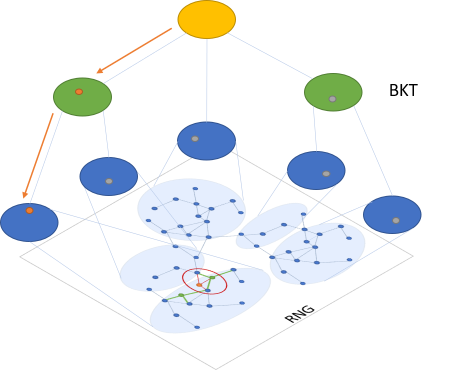

# Space Partition Tree And Graph for Vector Search

 SPTAG (Space Partition Tree And Graph) is a toolkit which provides a high quality vector index build, search and distributed online serving toolkits for large scale vector search scenario. 
 <p align="center">
 
 </p>

 ## **Why to consider using SPTAG**
 * Performance
 * New features
  1. ..
  2. ..

 ## **Install**

### **requirements**

* cmake >= 3.12.0
* boost >= 1.67.0

### **compile && install**

> For Linux:
```bash
mkdir build
cd build && cmake .. && make
```
It will generate a Release folder in the code directory which contains all the build targets.

> For Windows:
```bash
mkdir build
cd build && cmake -A x64 ..
```
It will generate a SPTAGLib.sln in the build directory, open the solution in the Visual Studio (at least 2015) and compile the ALL_BUILD project, it will generate a Release directory which contains all the build targets.

### **test** 

Run the test (or Test.exe) in the Release folder to verify all the tests have passed.

## **Documentation**

* Overview
* Get started

## **Contribute**

This project welcomes contributions and suggestions from all the users.

We use GitHub issues for tracking bugs.

## **License**
The entire codebase is under [MIT license](https://github.com/Microsoft/SPTAG/blob/master/LICENSE)