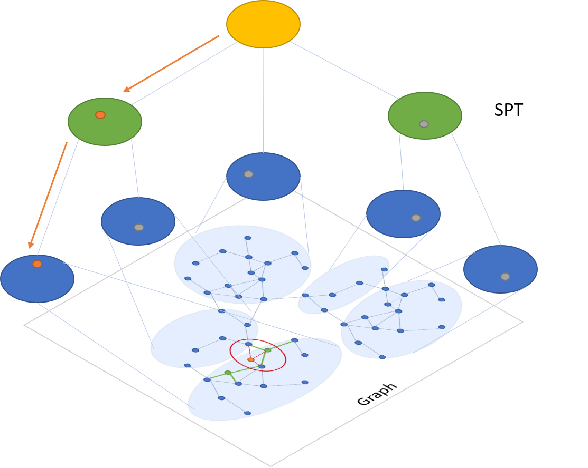

# SPTAG: A library for fast approximate nearest neighbor search

[](https://github.com/Microsoft/SPTAG/blob/master/LICENSE)
[](https://sysdnn.visualstudio.com/SPTAG/_build/latest?definitionId=2)

## **SPTAG**
 SPTAG (Space Partition Tree And Graph) is a library for large scale vector approximate nearest neighbor search scenario released by [Microsoft Research (MSR)](https://www.msra.cn/) and [Microsoft Bing](http://bing.com). 

 <p align="center">
 
 </p>

## What's NEW
* **Multi-Tenant SPANN with Per-Tenant Isolation** — see [Multi-Tenant Features](#multi-tenant-features) below
* Result Iterator with Relaxed Monotonicity Signal Support
* New Research Paper [SPFresh: Incremental In-Place Update for Billion-Scale Vector Search](https://dl.acm.org/doi/10.1145/3600006.3613166) - _published in SOSP 2023_
* New Research Paper [VBASE: Unifying Online Vector Similarity Search and Relational Queries via Relaxed Monotonicity](https://www.usenix.org/system/files/osdi23-zhang-qianxi_1.pdf) - _published in OSDI 2023_

## **Introduction**
 
This library assumes that the samples are represented as vectors and that the vectors can be compared by L2 distances or cosine distances. 
Vectors returned for a query vector are the vectors that have smallest L2 distance or cosine distances with the query vector. 

SPTAG provides two methods: kd-tree and relative neighborhood graph (SPTAG-KDT) 
and balanced k-means tree and relative neighborhood graph (SPTAG-BKT).
SPTAG-KDT is advantageous in index building cost, and SPTAG-BKT is advantageous in search accuracy in very high-dimensional data.


## **How it works**

SPTAG is inspired by the NGS approach [[WangL12](#References)]. It contains two basic modules: index builder and searcher. 
The RNG is built on the k-nearest neighborhood graph [[WangWZTG12](#References), [WangWJLZZH14](#References)] 
for boosting the connectivity. Balanced k-means trees are used to replace kd-trees to avoid the inaccurate distance bound estimation in kd-trees for very high-dimensional vectors.
The search begins with the search in the space partition trees for 
finding several seeds to start the search in the RNG. 
The searches in the trees and the graph are iteratively conducted. 

 ## **Highlights**
  * Fresh update: Support online vector deletion and insertion
  * Distributed serving: Search over multiple machines

 ## **Build**

### **Requirements**

* swig >= 4.0.2
* cmake >= 3.12.0
* boost >= 1.67.0

### **Fast clone**

```
set GIT_LFS_SKIP_SMUDGE=1
git clone --recurse-submodules https://github.com/microsoft/SPTAG

OR

git config --global filter.lfs.smudge "git-lfs smudge --skip -- %f"
git config --global filter.lfs.process "git-lfs filter-process --skip"
```

### **Install**

> For Linux:
> Compile SPDK
```bash
cd ThirdParty/spdk
./scripts/pkgdep.sh
CC=gcc-9 ./configure
CC=gcc-9 make -j
```

> Compile isal-l_crypto
```bash
cd ThirdParty/isal-l_crypto
./autogen.sh
./configure
make -j
```

> Build RocksDB
```bash
mkdir build && cd build
cmake -DUSE_RTTI=1 -DWITH_JEMALLOC=1 -DWITH_SNAPPY=1 -DCMAKE_C_COMPILER=gcc-7 -DCMAKE_CXX_COMPILER=g++-7 -DCMAKE_BUILD_TYPE=Release -DCMAKE_CXX_FLAGS="-fPIC" ..
make -j
sudo make install
```

> Build SPTAG
```bash
mkdir build
cd build && cmake -DSPDK=OFF -DROCKSDB=OFF .. && make
```
It will generate a Release folder in the code directory which contains all the build targets.

> For Windows:
```bash
mkdir build
cd build && cmake -A x64 -DSPDK=OFF -DROCKSDB=OFF ..
```
It will generate a SPTAGLib.sln in the build directory. 
Compiling the ALL_BUILD project in the Visual Studio (at least 2019) will generate a Release directory which contains all the build targets.

For detailed instructions on installing Windows binaries, please see [here](docs/WindowsInstallation.md)

> Using Docker:
```bash
docker build -t sptag .
```
Will build a docker container with binaries in `/app/Release/`.

### **Verify** 

Run the SPTAGTest (or Test.exe) in the Release folder to verify all the tests have passed.

### **Usage**

The detailed usage can be found in [Get started](docs/GettingStart.md). There is also an end-to-end tutorial for building vector search online service using Python Wrapper in [Python Tutorial](docs/Tutorial.ipynb).
The detailed parameters tunning can be found in [Parameters](docs/Parameters.md).

## **References**
Please cite SPTAG in your publications if it helps your research:
```
@inproceedings{xu2023spfresh,
  title={SPFresh: Incremental In-Place Update for Billion-Scale Vector Search},
  author={Xu, Yuming and Liang, Hengyu and Li, Jin and Xu, Shuotao and Chen, Qi and Zhang, Qianxi and Li, Cheng and Yang, Ziyue and Yang, Fan and Yang, Yuqing and others},
  booktitle={Proceedings of the 29th Symposium on Operating Systems Principles},
  pages={545--561},
  year={2023}
}

@inproceedings{zhang2023vbase,
  title={$\{$VBASE$\}$: Unifying Online Vector Similarity Search and Relational Queries via Relaxed Monotonicity},
  author={Zhang, Qianxi and Xu, Shuotao and Chen, Qi and Sui, Guoxin and Xie, Jiadong and Cai, Zhizhen and Chen, Yaoqi and He, Yinxuan and Yang, Yuqing and Yang, Fan and others},
  booktitle={17th USENIX Symposium on Operating Systems Design and Implementation (OSDI 23)},
  year={2023}
}

@inproceedings{ChenW21,
  author = {Qi Chen and 
            Bing Zhao and 
            Haidong Wang and 
            Mingqin Li and 
            Chuanjie Liu and 
            Zengzhong Li and 
            Mao Yang and 
            Jingdong Wang},
  title = {SPANN: Highly-efficient Billion-scale Approximate Nearest Neighbor Search},
  booktitle = {35th Conference on Neural Information Processing Systems (NeurIPS 2021)},
  year = {2021}
}

@manual{ChenW18,
  author    = {Qi Chen and
               Haidong Wang and
               Mingqin Li and 
               Gang Ren and
               Scarlett Li and
               Jeffery Zhu and
               Jason Li and
               Chuanjie Liu and
               Lintao Zhang and
               Jingdong Wang},
  title     = {SPTAG: A library for fast approximate nearest neighbor search},
  url       = {https://github.com/Microsoft/SPTAG},
  year      = {2018}
}

@inproceedings{WangL12,
  author    = {Jingdong Wang and
               Shipeng Li},
  title     = {Query-driven iterated neighborhood graph search for large scale indexing},
  booktitle = {ACM Multimedia 2012},
  pages     = {179--188},
  year      = {2012}
}

@inproceedings{WangWZTGL12,
  author    = {Jing Wang and
               Jingdong Wang and
               Gang Zeng and
               Zhuowen Tu and
               Rui Gan and
               Shipeng Li},
  title     = {Scalable k-NN graph construction for visual descriptors},
  booktitle = {CVPR 2012},
  pages     = {1106--1113},
  year      = {2012}
}

@article{WangWJLZZH14,
  author    = {Jingdong Wang and
               Naiyan Wang and
               You Jia and
               Jian Li and
               Gang Zeng and
               Hongbin Zha and
               Xian{-}Sheng Hua},
  title     = {Trinary-Projection Trees for Approximate Nearest Neighbor Search},
  journal   = {{IEEE} Trans. Pattern Anal. Mach. Intell.},
  volume    = {36},
  number    = {2},
  pages     = {388--403},
  year      = {2014
}
```

## **Contribute**

This project welcomes contributions and suggestions from all the users.

We use [GitHub issues](https://github.com/Microsoft/SPTAG/issues) for tracking suggestions and bugs.

## **Multi-Tenant Features**

This fork adds production-grade multi-tenant support on top of SPANN:

### Architecture
- **Per-tenant SPANN index**: each tenant has independent HeadIndex + posting files, query isolation guaranteed
- **LRU HeadIndex cache** with configurable memory budget (`SetHeadIndexCacheLimit`)
- **SharedAIOPool**: global AIO context pool eliminates `io_destroy` overhead on eviction (930ms → 2ms)
- **Dirty flag checkpoint**: `ShutDown` only writes back when data was modified (`Put/Delete/Merge`)
- **Lazy-load**: tenants loaded on first query, evicted under memory pressure

### ACL/Tag Filtered Search
- **Posting Signature (PS)**: per-posting Bloom128 filter, hard-rejects postings before SSD read
- **Hierarchical tags**: supports multi-level ACL (org/dept/team/project), all levels in one Bloom
- **Mid-filtering**: filters between graph search output and SSD IO — graph traversal unchanged
- **22-120× speedup** at 0.39-25% selectivity, Recall@10 = 1.0

### API
```python
from sptag import SPTAG

# Create manager
mgr = SPTAG.CreateTenantIndexManager(128, "SPANN", "Float")

# Build with tags
mgr.BuildFromDataWithTags(vectors, metadata, n, tags, num_tags_per_vec, True, False)
mgr.SaveAll("/path/to/index")

# Load and search
mgr.LoadAll("/path/to/index")
result = mgr.Search(query, tenant_id, topk)                              # unfiltered
result = mgr.SearchWithACL(query, tenant_id, topk, query_tags, num_tags) # filtered

# Cache control
mgr.SetHeadIndexCacheLimit(64 * 1024 * 1024)  # 64MB HeadIndex budget
```

### Performance (SIFT-1M, 100 tenants, AMD EPYC 24 vCPU)

| Metric | Value |
|--------|-------|
| Recall@10 (all tenant sizes) | ≥ 0.996 |
| Warm query latency | 2.8-4.3 ms |
| Eviction latency | 2-4 ms |
| Cold load (page cache warm) | 16-60 ms |
| Filtered search (1.56% sel.) | 10-22 ms (60-120× vs unfiltered) |

### Dual-Pool Head Index — Usage Modes

The per-tag **dual-pool** head index (bundle subgraphs + cross-edges + optional
U_extra augmentation) shares a **single binary** with the vanilla build; all modes
are selected via env vars and build-script arguments:

| Mode | Head selection | Subgraphs | U_extra | Build command |
| ---- | -------------- | --------- | ------- | ------------- |
| **A. Vanilla** | `BKT` (global ratio) | 1 global | — | `build_tenant0_baseline.py --ratio R` |
| **B. Dual-pool** | `PerTagBKT` | `--group-target N` + cross-edges | — | `build_tenant0_pertag.py --final-ratio R --group-target N` |
| **C. Dual-pool + U_extra** | `PerTagBKT` | `N` + reverse H1→U_extra edges | `SPTAG_DUAL_POOL_AUGMENT=1` | Mode B + `SPTAG_DUAL_POOL_EXTRA_RATIO=0.10` |

> Note: `--group-target 1` + no U_extra is **not** vanilla — head selection is still
> per-tag. True vanilla also requires `selectType = BKT`.

Modes B/C also run `augmentheadgraph` to build cross-subgraph edges. See
**[docs/MultiTenant_DualPool_Usage.md](docs/MultiTenant_DualPool_Usage.md)** for
full commands, the asymmetric-edge U_extra design, the slim head store, and the
complete environment-variable reference.

#### Unfilter enhancement layers (enable together — default OFF)

For good **unfiltered** recall/QPS on a partitioned (PerTagBKT + ACL hierarchy)
index, **all three** layers below must be built. They are env/tool-gated and are
**not** produced by a plain `spannbuilder` build, so they are easy to lose —
without them, unfilter degrades to a bare per-node fan-out across the ACL bundle
nodes. See **AGENTS.md → "Unfilter Enhancement Pipeline"** and
**[docs/MultiTenant_SIFT1M_UnfilterTail.md](docs/MultiTenant_SIFT1M_UnfilterTail.md)**.

| Layer | Enable (build) | Enable (search) |
| ----- | -------------- | --------------- |
| ① cross-graph | post-build: `Release/augmentheadgraph -d <index>/tenant_0/HeadIndex -k 15 -m 10 -t N -w true` | (auto) |
| ② U_extra (~10% extra unfilter-only heads) | `SPTAG_DUAL_POOL_AUGMENT=1` `SPTAG_DUAL_POOL_EXTRA_RATIO=0.1` | (auto) |
| ③ unfilter-tail (K nearest-head tail copies/vector) | `SPTAG_UNFILTER_TAIL_K_REPLICA=K` `SPTAG_UNFILTER_TAIL_BUFFER_PAGES=P` | `SPTAG_UNFILTER_TAIL=1` `SPTAG_UNFILTER_TAIL_BUFFER_PAGES=P` |

#### Native `.ini` build config (recommended — single source of truth)

Rather than exporting the `SPTAG_*` knobs above by hand, the attribute-aware build
is driven by a **native SPANN sectioned `.ini`** (read by `Helper::IniReader`, the
same loader the classic `IndexBuilder` uses). All build parameters — standard SPANN
posting knobs *and* the multi-tenant/unfilter extensions — live in one committed
file, so nothing is lost when `/tmp` is wiped:

```bash
# config = Script_AE/iniFile/build_spann_attr_spacev_opq25.ini
Tools/benchmarks/run_spann_attr_build.sh [config.ini]   # launcher (derives paths from the ini)
#   internally: Release/spannbuilder -c <config.ini>  +  post-build augmentheadgraph
```

- `[BuildSSDIndex]` (`Storage`, `ReplicaCount`, `PostingQuantizer`/`PostingQuantM`/
  `PostingQuantizerFile`, `FullVectorFile`, `RerankL`, `StartFileSizeGB`/`MaxFileSizeGB`)
  flows through the native `SetSSDBuildParam` path.
- `[SelectHead]`/`[BuildHead]`/`[MultiTenant]` carry the extensions (ACL routing,
  hier widths, numeric cols, and the three unfilter layers above), bridged to their
  existing `getenv` consumers.
- Comments MUST start with `;`; an explicit CLI flag overrides any ini value.

See **AGENTS.md → "Build Config — Native `.ini`"** for the full key→engine mapping.

#### In-posting quantization + deep-queue rerank

Postings can store a compact **RaBitQ/OPQ code** per vector instead of the full
vector (~4× fewer bytes/scan); the top-`L` survivors are exact-reranked by cold
O_DIRECT reads from the full-precision base, batched through a **deep-queue libaio**
reader (one `io_submit` for all `L`, ~12µs/read). Enable at build via
`[BuildSSDIndex] PostingQuantizer=OPQ|RaBitQ` + `PostingQuantM` + `FullVectorFile`
+ `RerankL`; at search via `SPTAG_INPOST_RBQ=1` + `SPTAG_INPOST_LIBAIO_RERANK=1`
(do **not** combine the RaBitQ async path with `SPTAG_OPQ_PREFILTER`). See
**AGENTS.md → "In-posting Quantization + Deep-queue Rerank"**.

### Build
```bash
mkdir build && cd build && cmake ..
bash rebuild_and_editable_install.sh  # builds + pip install -e .
```

## **License**
The entire codebase is under [MIT license](https://github.com/Microsoft/SPTAG/blob/master/LICENSE)
