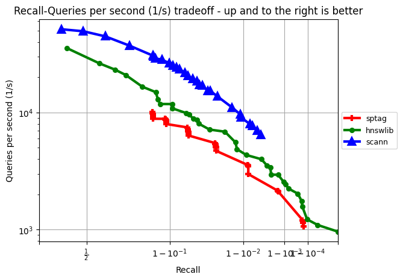

# ANN-auto-tune using NNI


## Requirements

This example requires NNI >= 2.8, python == 3.6/3.8


```sh
pip install nni
```
For more details, please view [NNI installation](https://nni.readthedocs.io/en/stable/installation.html)

Install SPTAG

```sh
pip install -i https://test.pypi.org/simple/ sptag
```

Install other dependencies

```sh
pip install multiprocess
```

## Dataset

We support muiltiple types of data for training. Including text file, binary file and [ann-benchmark](https://github.com/erikbern/ann-benchmarks) format hdf5 file. But the groundturth file should only be texts of index.

In many cased, parameters that works fine in sampled dataset also work in original dataset. So we also provided a preprocessing script for dataset sampling and ground truth calculation. You can use follow command to do sample and ground truth pre-calculate.

```sh
python preprocessing.py --train_file victors.bin --query_file query.bin --output_dir sampled/ --distance euclidean  --num_sample 100000
```

If you only need to calculate ground truth for time save in auto-tune, which we highly recommend, you can set `--num_sample` to -1

## Quickstart


Use this command to start a NNI trial to tune SPTAG model on ann-benchmark format hdf5 sift-128-euclidean dataset.
```sh
nnictl create --config config.yml
```

If you wish to tune SPTAG on a binary dataset or text dataset, the input file format are as below.

#### DEFAULT (Binary)
> Input raw data for index build and input query file for index search (suppose vector dimension is 3):

```
<4 bytes int representing num_vectors><4 bytes int representing num_dimension>
<num_vectors * num_dimension * sizeof(data type) bytes raw data>
```

#### TXT
> Input raw data for index build and input query file for index search (suppose vector dimension is 3):

```
<metadata1>\t<v11>|<v12>|<v13>|
<metadata2>\t<v21>|<v22>|<v23>|
...
```
where each line represents a vector with its metadata and its value separated by a tab space. Each dimension of a vector is separated by | or use --delimiter to define the separator.

> Truth file to calculate recall (suppose K is 2):
```
<t11> <t12>
<t21> <t22>
...
```
where each line represents the K nearest neighbors of a query separated by a blank space. Each neighbor is given by its vector id.

Then you can change `trialCommand` in config.yml to:

```sh
python main.py --train_file victors.bin --query_file query.bin --label_file truth.txt --distance euclidean
```

You can also specify `--max_build_time` or `--max_memory` if you have build time limit or search memory usage limit in your project. they both default to -1, which mean no limit.

**NOTE:** Always clear corresponding folder under `results/` before starting a trial on same dataset.

## Results

Install matplotlib for figure drawing

```sh
pip install matplotlib
```

During the trial, the results are saved as json files in `results/(dataset_name)`. Use following command to visualize results.

```sh
plot.py --path sift-128-euclidean
```
The figure shows the correspondence between recall and qps. And you can see the details of each selected point in console.


The following are the results of sptag and other algorithms on different datasets

sift-128-euclidean
------------------


glove-100-angular
------------------


glove-25-angular
------------------



nytimes-256-angular
------------------


fashion-mnist-784-euclidean
------------------


