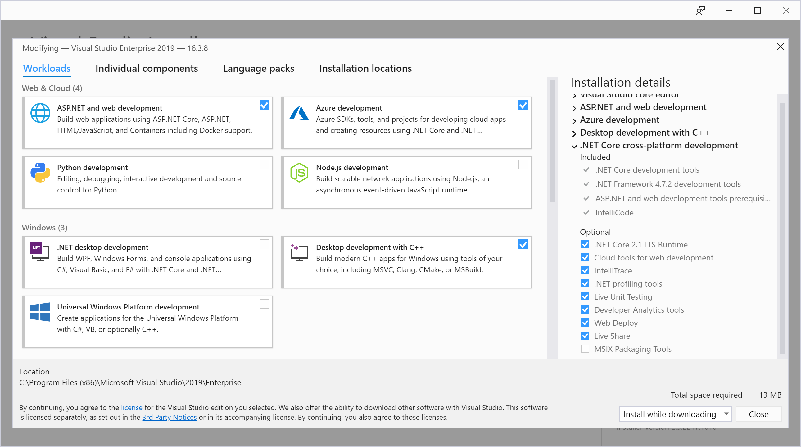

## Requirements

### swig >= 3.0

Steps to install SWIG: 

1. Download the latest SWIG binary from http://www.swig.org/download.html, if you need a specific version, windows binaries are located at https://sourceforge.net/projects/swig/files/swigwin/. Once downloaded, please unzip to a local folder (prefarably inside the SPTAG folder) 
2. Add the path where it was unzipped to the environment PATH example: `C:\Sptag\swigwin-3.0.12\` in System properties

### cmake >= 3.12.0

1. If you have Visual Studio 2019 you already have the required tools to compile, please ensure you have the `Desktop Development with C++` selected to get all the tools, just ensure this option is enabled in the installation workloads
2. If not, please download cmake



### boost == 1.67.0

Boost's precompiled binaries are available at https://sourceforge.net/projects/boost/files/boost-binaries/1.67.0/ (to avoid compiling from scratch) 

1. Select the lastest version for 1.67.0 (boost_1_67_0-msvc-14.1-64.exe)
2. Launch the installation
3. Add the folder path to PATH environment variable, for instance `C:\Sptag\boost_1_67_0\`


## Build

1. git clone [microsoft/SPTAG](https://github.com/microsoft/SPTAG/)
2. Go the folder location where you cloned the repo in the command prompt and execute the following commands:
```
mkdir build
cd build
cmake -A x64 ..
```
5. From the build folder, open SPTAGLib.sln solution in Visual Studio and compile all projects

6. [..]/build/release contains now all components needed, add this path to PYTHONPATH environment variable to reference the required modules
