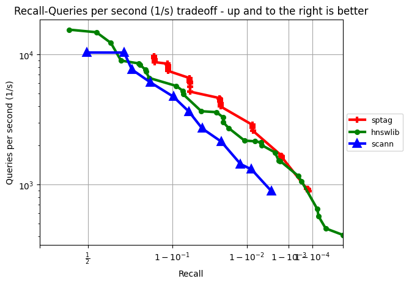
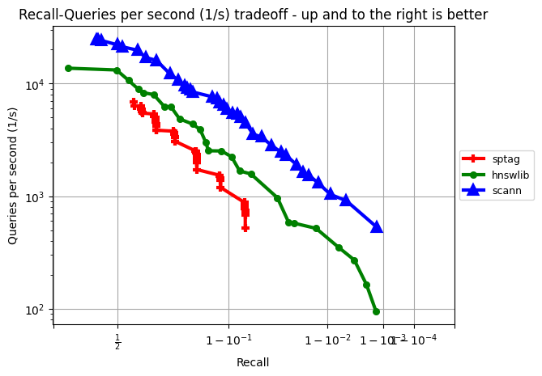
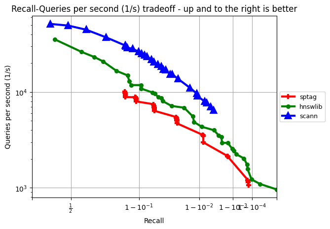
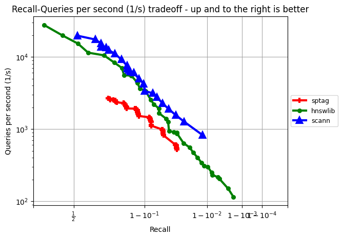
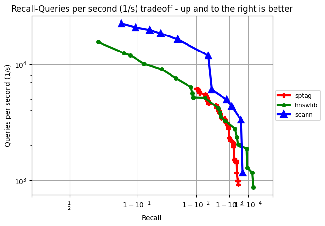

# ANN-auto-tune using NNI


## Requirements

This example requires NNI >= 2.8, python >= 3.9, Ubuntu >= 20.04


```sh
pip install nni
```
For more details, please view [NNI installation](https://nni.readthedocs.io/en/stable/installation.html)

Install SPTAG

```sh
pip install -i https://test.pypi.org/simple/ sptag
```

## Dataset

We support muiltiple types of data for training. Including text file, binary file and [ann-benchmark](https://github.com/erikbern/ann-benchmarks) format hdf5 file. But the groundturth file should only be texts of index.

## Quickstart


Use this command to start a NNI trial to tune SPTAG model on ann-benchmark format hdf5 sift-128-euclidean dataset.
```sh
nnictl create --config config.yml
```

If you wish to tune SPTAG on a binary dataset, for example, origin sift dataset. You can change `trialCommand` in config.yml to:

```sh
python main.py --train_file /sift/sift_base.fvecs --query_file sift/sift_query.fvecs --distance euclidean --dim 128
```

**NOTE:** Always clear corresponding folder under `results/` before starting a trial on same dataset.


## Results

Install matplotlib for figure drawing

```sh
pip install matplotlib
```

During the trial, the results are saved as json files in `results/(dataset_name)`. Use following command to visualize results.

```sh
plot.py --path sift-128-euclidean
```
The figure shows the correspondence between recall and qps. And you can see the details of each selected point in console.


The following are the results of sptag and other algorithms on different datasets

sift-128-euclidean
------------------



glove-100-angular
------------------



glove-25-angular
------------------



nytimes-256-angular
------------------



fashion-mnist-784-euclidean
------------------



