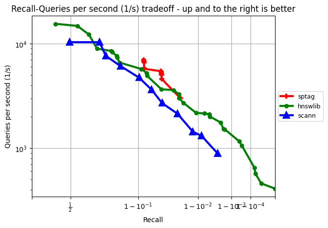
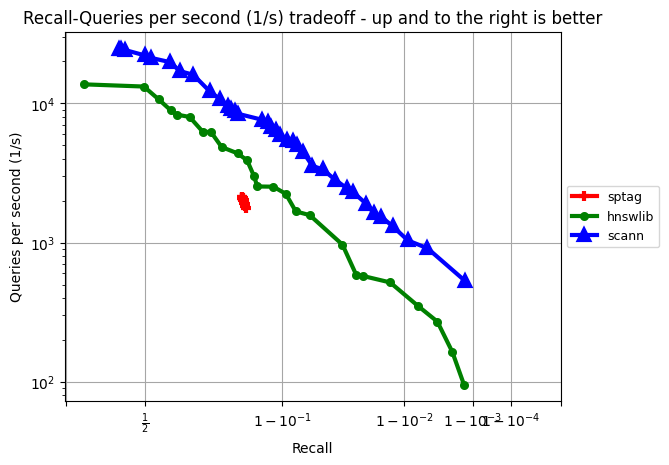

# ANN-auto-tune using NNI


## Requirements

This example requires NNI >= 2.8

```sh
pip install nni
```
For more details, please view [NNI installation](https://nni.readthedocs.io/en/stable/installation.html)

Install SPTAG

```sh
pip install sptag
```

Install h5py

```sh
pip install h5py
```

## Dataset

This example uses hdf5 datasets from [ann-benchmark](https://github.com/erikbern/ann-benchmarks). Please download hdf5 dataset under this folder.

## Quickstart


Use this command to start a NNI trial.
```sh
nnictl create --config config_sift.yaml
```

We currently have two configs for `glove-100-angular` and `sift-128-euclidean`. 

**NOTE:** Always clear corresponding folder under `results/` before starting a trial on same dataset.


## Results

During the trial, the results are saved as json files in `results/(dataset_name)`. Use following command to visualize results.

```sh
plot.py --dataset sift-128-euclidean
```
The figure the correspondence between recall and qps.


The following are the results of sptag and other algorithms on different datasets

sift-128-euclidean
------------------



sift-128-euclidean
------------------



